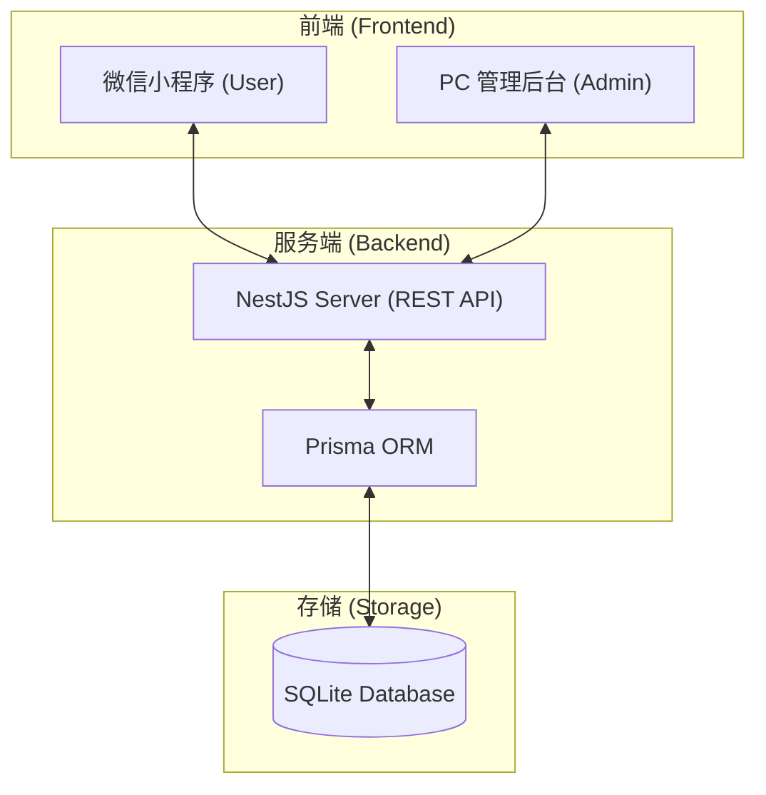

# DTCI 项目

基于墨刀原型开发的 DTCI 健康管理平台，正式升级为包含**管理后台、NestJS 服务端、小程序端**的三层架构系统。

## 🏛️ 项目架构



## 📂 项目结构

```
DTCI/
├── mini-program/     # 小程序端（用户端）
│   ├── pages/         # 页面视图
│   └── utils/         # 接口对接与逻辑处理
│
├── admin/            # PC管理后台（Vite + React）
│   ├── src/
│   │   ├── pages/     # 包含用户、分销、内容及系统设置
│   │   └── services/  # 对接服务端 API
│
└── server/           # NestJS 服务端（核心逻辑）
    ├── prisma/        # 数据库模型与迁移文件
    └── src/           # 模块化开发（Admins, Users, Auth）
```

## ✨ 核心功能

### 🛡️ 管理系统 (Admin System)
- **真实账户验证**：基于数据库字段校验，不再使用模拟登录。
- **密码安全**：采用 `bcrypt` 工业级哈希加密存储。
- **管理员管理**：支持在线添加、禁用管理员，及重置密码（123456）。
- **用户列表增强**：
    - **后端搜索**：支持关键字（姓名/手机/OpenID）与性别的实时过滤。
    - **头像机制**：修复碎图，实现“微信临时路径自动过滤 + 默认头像降级”。
    - **字段扩展**：新增“城市”信息展示与持久化。

### 📱 小程序端 (Mini-Program)
- **微信授权登录**：支持 OpenID 自动识别及手机号一键授权。
- **信息持久化**：修正了个人信息页面（昵称、城市等）修改后的 404 存储问题。

## 🛠️ 技术栈

### 服务端 (Backend)
- **NestJS** (v11+)
- **Prisma ORM** (数据持久化)
- **SQLite** (零配置数据库)
- **bcryptjs** (密码加密)

### 管理后台 (Admin)
- **React 18**
- **Ant Design 5**
- **React Router 6**

## 🚀 快速开始

### 1. 服务端配置
```bash
cd server
npm install
# 同步数据库结构
npx prisma db push
# 启动服务 (默认端口 3100)
npm run start:dev
```

### 2. 管理后台配置
```bash
cd admin
npm install
npm run dev
```
访问 http://localhost:5180 (或 Vite 提示的链接)。

**默认管理账号：**
- 用户名：`admin`
- 密码：`admin123`

### 3. 小程序端
1. 导入 `mini-program` 目录到微信开发者工具。
2. 确保 `app.js` 或请求配置中的 `baseURL` 指向正在运行的服务器地址。

## 🔗 相关资源
- 小程序端原型：https://modao.cc/proto/JIreaoE6sunte26u5g5hyB
- PC管理端原型：https://modao.cc/proto/FsxDsCKzsv5ch4OumFOHe

## 原型链接

- 小程序端原型：https://modao.cc/proto/JIreaoE6sunte26u5g5hyB
- PC管理端原型：https://modao.cc/proto/FsxDsCKzsv5ch4OumFOHe
